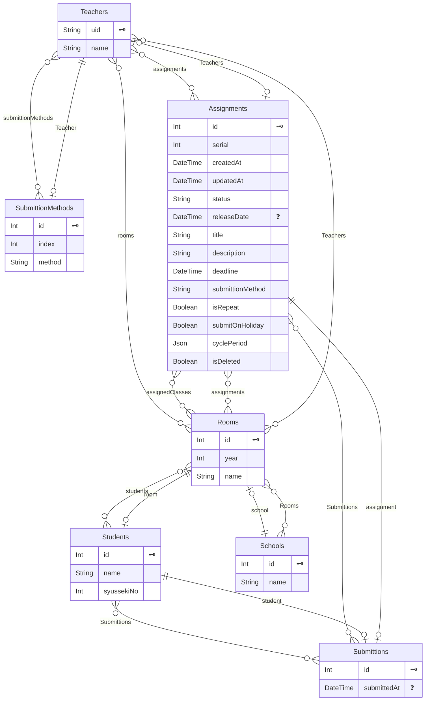

```mermaid
erDiagram

  "Teachers" {
    String uid "🗝️"
    String name 
    }
  

  "SubmittionMethods" {
    Int id "🗝️"
    Int index 
    String method 
    }
  

  "Submittions" {
    Int id "🗝️"
    DateTime submittedAt "❓"
    }
  

  "Students" {
    Int id "🗝️"
    String name 
    Int syussekiNo 
    }
  

  "Schools" {
    Int id "🗝️"
    String name 
    }
  

  "Rooms" {
    Int id "🗝️"
    Int year 
    String name 
    }
  

  "Assignments" {
    Int id "🗝️"
    Int serial 
    DateTime createdAt 
    DateTime updatedAt 
    String status 
    DateTime releaseDate "❓"
    String title 
    String description 
    DateTime deadline 
    String submittionMethod 
    Boolean isRepeat 
    Boolean submitOnHoliday 
    Json cyclePeriod 
    Boolean isDeleted 
    }
  
    "Teachers" o{--}o "SubmittionMethods" : "submittionMethods"
    "Teachers" o{--}o "Assignments" : "assignments"
    "Teachers" o{--}o "Rooms" : "rooms"
    "SubmittionMethods" o|--|| "Teachers" : "Teacher"
    "Submittions" o|--|| "Students" : "student"
    "Submittions" o|--|| "Assignments" : "assignment"
    "Students" o|--|| "Rooms" : "room"
    "Students" o{--}o "Submittions" : "Submittions"
    "Schools" o{--}o "Rooms" : "Rooms"
    "Rooms" o|--|| "Schools" : "school"
    "Rooms" o{--}o "Students" : "students"
    "Rooms" o{--}o "Assignments" : "assignments"
    "Rooms" o{--}o "Teachers" : "Teachers"
    "Assignments" o{--}o "Rooms" : "assignedClasses"
    "Assignments" o{--}o "Submittions" : "Submittions"
    "Assignments" o|--|o "Teachers" : "Teachers"
```
